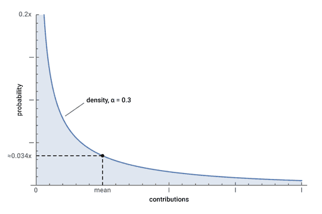

# :chart_with_upwards_trend: CCh

GitHub contributions statistics cheat. Generates a random number of commits
following a gamma distribution:



Distribution type and parametrization based on my humble GitHub activity
statistics research.

I did it for the lulz. I know that it's dumb, and that people don't like old
memes. Just don't bug me and yourself.

## Setup

Create a fork and run the setup script:
```sh
git clone git@github.com:rnln/cch.git
cd cch
python3 setup.py
```

Setup module creates a virtual environment in `/path/to/cch/venv/` and a cron
job to run `cch.py` daily. Job sample:
```sh
* * 0 0 0 /home/user/cch/venv/bin/python /home/user/cch/cch.py # CCh
```

## License

Copyright © 2020 Roman Ilin ([contacts][contacts]).

This work is free. You can redistribute and modify it under the terms of the
Do What The Fuck You Want To Public License, Version 2, as published by Sam
Hocevar. See the [COPYING file](./COPYING) for more details.

[![WTFPL 2.0][wtfpl-badge]][wtfpl-website]

[wtfpl-website]: http://wtfpl.net
[wtfpl-badge]: http://wtfpl.net/wp-content/uploads/2012/12/wtfpl-badge-2.png
[contacts]: https://rilin.me/contacts
